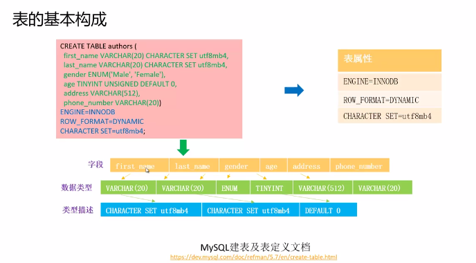

# 华为云RDS for MySQL

DAS  数据管理服务

### 1.表和索引

- 库
- 表




- 索引

  


如果需要其它字段，则需要回表查询


```
SHOW DATABASES;

CREATE DATABASE library;

SHOW DATABASES;

USE library;

SHOW TABLES;

CREATE TABLE authors (

  first_name VARCHAR(20) CHARACTER SET utf8mb4,

  last_name VARCHAR(20) CHARACTER SET utf8mb4,

  gender ENUM('Male', 'Female'),

  age TINYINT UNSIGNED DEFAULT 0,

  address VARCHAR(512),

  phone_number VARCHAR(20),

  PRIMARY KEY(first_name, last_name),

  UNIQUE KEY(phone_number),

  KEY(address))

ENGINE=INNODB ROW_FORMAT=DYNAMIC

CHARACTER SET=utf8mb4;

SHOW TABLES;

SHOW CREATE TABLE authors;
```

### 2.DDL和DML


表是位于数据库下的元素


- DML

  


