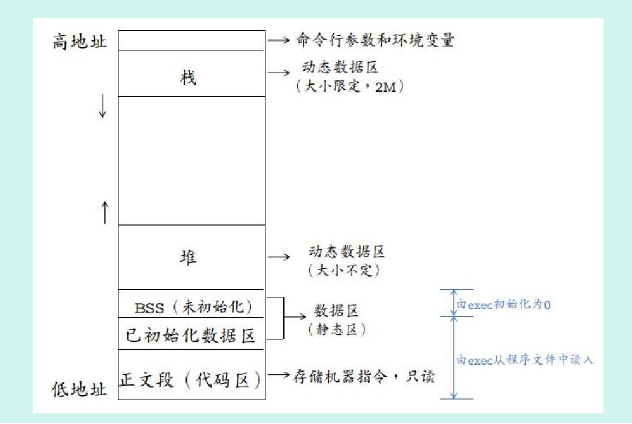

# CCS 链接命令文件.cmd

读map 文件理解内存管理 

SECTION ALLOCATION MAP

 output                                  attributes/
section   page    origin      length       input sections
--------  ----  ----------  ----------   ----------------
.intvecs   0    00000000    0000026c     
                  00000000    0000026c     startup_ccs.obj (.intvecs)

.text      0    0000026c    00005058     
                  0000026c    00000f80     sysctl.obj (.text)
                  000011ec    00000b94     gpio.obj (.text)
                  00001d80    00000a90     uartstdio.obj (.text)

……………………


汇编器已经将源文件（.asm）顺序地按段的定义（SPC）转换 成机器语言目标文件（.obj文件)，即COFF文件， 连接器的主要任务是根据连接命令或连接命令文件（.cmd）将一个或多个 COFF目标文件连接起来，生成存储器映象文件（.map）和可执行的输出 文件（.out文件），即COFF目标模块。 链接过程为：

（1）将各个目标文件合并起来，将各个文件的各个段配置到目标系统的存储器中

（2）对各个符号和段进行重定位，并给它们指定一个最终的地址

（3）解决输入文件之间未定义的外部引用


程序被分解成各种块的组合体：如文本块、数据块等

程序员设计时只需基于代码块和数据块等概念进行，不需关注每条命令或每个数据的具体目标地址。至于它们的最终将处于存储器的哪个位置，将由链接器来安排


链接器的核心工作就是符号表解析和重定位，链接命令文件则使得编程者可以给链接器提供必要的指导和辅助信息


**段（section）**

编译器生成可重分配地址的代码块和数据块，这些块被叫做“段”。通过段名对代码块和数据块的标识，连接器就能在链接的时候根据链接规则（默认规则或链接命令文件制定）将代码块和数据块分配到指定的存储空间中。


Section目标文件中最小单位称为块。一个块就是最终在存储器映象中占据连续空间的一段代码或数据。所有的section按照是否自定义可以分为：

（1）Coff默认的section (2)自定义的section ，按照是否初始化可以分为：（1）初始化的section（2）未初始化的section


汇编器有5个伪指令支持标识汇编语言程序各个部分应归属的段：.text  .data  .sect  .bss  .usect。编程者也可以创建任一种段的子段，得以更精细地控制存储器区域。

**初始化段：**.text .data .sect创建初始化段。

- .text：代码区间。
- .data：已初始化的全局和静态变量。
- .sect：创建类似于.text .data 的命名段，同时用于创建子段。

**未初始化段：**.bss .usect指令创建未初始化段。

- .bss：未初始化的全局和静态变量，以及被初始化为0的全局和静态变量。
- .usect：创建类似于.bss的命名段，同时用于创建子段。

含有原始数据的段，归类为初始化的，意味着目标文件含有该段的存储器实际内容映像；默认情况下，.bss段和.usect伪指令定义的段没有原始数据，它们在存储器映射图里占据空间，但没有实际内容。每次使用bss和usect伪指指令时，汇编器就在.bss或该命名段内预留增补的空间。在目标文件里，一个未初始化段有正常的段头，也可以含有定义在其内的符号，但没有存于段内的存储器映像。

命名段是用户创建的，可以像.text  .data  .bss段一样使用它们。

子段是较大段内一些比较小的段，子段使用户更细致地控制存储器空间，一个子段可以单独分配地址，也可以与同一基段的其它子段分配在一起。子段用基段名加冒号加子段名来标识，对子段命名的语法如下：

> symbol .usect "section name:subsection name",size in bytes [,alignment [,bank offset]]
>
> .sect "section name:subsection name"

*-mo选项使得编译器把一个文件中的每一个函数放入它自己的子段中。这样，只有被应用程序调用的函数，才被连接到最后的可执行函数中，这可以导致整个代码的尺寸减小。但是，如果一个文件中几乎所有的函数都被引用，使用-mo编译器选项，也能导致整个代码尺寸的增加。*

C语言的section可以区分如下：


| section    | 作用                               |
| ---------- | ---------------------------------- |
| **.text**  | 可代码和常数                       |
| **.cinit** | 变量初值表                         |
| .switch    | 用于大型switch语句的跳转表         |
| **.const** | 常量和字符串                       |
|            |                                    |
| .bss       | 全局变量和静态变量                 |
| .system    | 全局堆（用于存储器的分配）         |
| .stack     | 堆栈                               |
| .far       | 以far声明的全局和静态变量          |
| .cio       | 用于stdio函数                      |
| .ebss      | 长调用的.bss(超过了64K地址限制)    |
| .esysmem   | 长调用的.sysmem(超过了64K地址限制) |
| econst     | 长.const（可定位到任何地方）       |

当然，C语言中可以自定义段

连接器也可以通过链接命令文件来完成，CMD文件由三部分组成：
(1) 输入输出定义；
这一部分，可以通过ccs的“Build Option........”菜单设置。主要包含以下几个部分：

[](http://images.cnblogs.com/cnblogs_com/zsb517/201207/201207052033171777.jpg)

具体的指令有：
-a 产生绝对地址(不可重新定位)的可执行模块,若没有指定-a或-r,默认情况为-a
-r 产生可重新定位不可执行的模块
-ar 产生可重新定位可执行的模块
-b 连接器将不合并任何由于多个文件而可能存在的重复符号表项,此项选择的效果是使连接器运行较快,但其代价是输出的COFF文件较大
-c 使用由TMS320C54x C/C++编译器的ROM自动初始化模型所定义的连接约定
-cr使用由C编译器的RAM自动初始化模型所定义的连接约定
-e global_symbol 定义全局符号为输出模块的指定主入口点
-f fill value为输出段中空洞设定默认的填充值, fill value为16位的常数
 -h 使所有的全局符号为静态变量
-g global_symbol保持指定的global_symbol为全局符号,而不管是否使用了-h选项
-help , -? 显示所有可利用的连接命令行选项
-head size为C语言的动态存储器分配设置堆栈大小,以字为单位,并定义指定的堆栈大小的全局符号,size有默认值为1k字
-i  dir 改变库搜索方法为在搜索默认的位置前先搜索dir ,该项必须在-l(L)选项之前出现
-l  filename  指定一个存档库文件为连接器的输入 , filename为存档库文件名,该选项必须在-i 选项之后出现,目录或文件名必须遵守操作系统的规定
-m filename  产生一个存储器(地址)映射文件,输出名为filename.map , 该文件列出了输入和输出段(包括空洞)的地址
-o filename 指定可执行输出模块的文件名(filename) , 默认为a.out , 目录或文件名必须遵守操作系统的规定
-q 请求静态运行(quiet run) ,即压缩旗标(banner)必须是在命令行的第一个选项
-s 从输出模块中去掉符号表信息和行号
-stack  size 设置C系统堆栈,大小以字为单位,并定义指定堆栈大小的全局符号,默认的size为1k
-u symbol 将不能分辩的外部符号放入输出模块的符号表
-vn 指定产生的COFF文件格式n , n=0、1或2，默认为COFF2
-w 当出现没有定义的输出段时，发出警告
-x 迫使重读库，以分辩后面的引用

CMD中也可以自定义section，用法如下：




\#pragma DATA_SECTION(函数名或全局变量名,"用户自定义在数据空间的段名");

\#pragma CODE_SECTION(函数名或全局变量名,"用户自定义在程序空间的段名");


例：   #pragma DATA_SECTION(g_pfnVectors, ".intvecs")，结合startup_ccs.c看。

参见下文  SECTIONS  部分。   .intvecs放在了rom起始， 程序运行后会将它搬去ram起始。

```
#pragma DATA_SECTION(g_pfnVectors, ".intvecs")
void (* const g_pfnVectors[])(void) =
{
    (void (*)(void))((uint32_t)&__STACK_TOP),
                                            // The initial stack pointer
    ResetISR,                               // The reset handler
    NmiSR,                                  // The NMI handler
    FaultISR,                               // The hard fault handler
    IntDefaultHandler,                      // The MPU fault handler
    IntDefaultHandler,                      // The bus fault handler
    IntDefaultHandler,                      // The usage fault handler
    0,                                      // Reserved
    0,                                      // Reserved
    0,                                      // Reserved
    0,                                      // Reserved
    IntDefaultHandler,                      // SVCall handler
    IntDefaultHandler,                      // Debug monitor handler
    0,                                      // Reserved
};

```


**加载时（load-time）和运行时（run-time）**

“加载时”和“运行时”是两个容易让人产生迷惑的概念，理解它们需要了解代码在硬件层面的详细被执行过程。

在掉电时，包含运行代码的可执行文件一般都存放于非易失的ROM或磁盘中，但由于这些存储器的访问速率受到限制，在实际上电运行时，还需要专门的一段加载代码（或称加载器），将需要的代码和数据段复制到主存中，然后通过跳转到程序的第一条指令或入口点，来运行该代码。这个将程序复制到内存，并开始运行的过程叫做加载。

加载地址确定了加载器把段的原始数据放置的位置，任何对这个段的引用涉及的是它的运行地址，运行时必须把这个段从加载地址复制到运行地址。这也就能理解为什么计算机术语上把诸如stdio、string等库文件称作运行时库（run-time lib），因为它们在运行时才被加载到和调用代码一起运行。


**链接命令文件语法**

连接器命令文件是ASCII码文件，包括一个或多个下述信息：

1. 输入文件。如目标文件、文档库、其它命令文件（如果一个命令文件调用另一个命令文件作为输入，这个语句必须是调用文件最后的语句，连接器不从被调用的命令文件返回）。
2. 连接器选项。它能以与命令行同样的方式应用于命令文件。
3. ***MEMORY和SECTION连接器伪指令（只能在命令文件里使用这些伪指令，不能在命令行上使用它们）。***
4. ***赋值语句。它定义全局符号并给它们赋值。***

下列名字作为连接器伪指令的关键字被保留，在命令文件里不要使用它们作为符号或段名：


一个完整的简单链接命令文件示例如下：

> a.obj b.obj c.obj /* Input filenames */
>
> --output_file=prog.out /* Options */
>
> --map_file=prog.map
>
> MEMORY /* MEMORY directive */
>
> {
>
>     FLASH (RX) : origin = 0x00000000, length = 0x00040000
>     SRAM (RWX) : origin = 0x20000000, length = 0x00008000
> }     **//这里面定义了  FLASH 和 SRAM 符号， 下文中使用了这两个符号**
>
> SECTIONS /* SECTIONS directive */
>
> {   //结合上文C语言section命令。
>
>     .intvecs:   > 0x00000000
>     .text   :   > FLASH
>     .const  :   > FLASH
>     .cinit  :   > FLASH
>     .pinit  :   > FLASH
>     .init_array : > FLASH
>    
>     .vtable :   > 0x20000000
>     .data   :   > SRAM
>     .bss    :   > SRAM
>     .sysmem :   > SRAM
>     .stack  :   > SRAM
> }
>
> __STACK_TOP = __stack + 512;

上述示例中， 第一行为输入文件， 接下来是连接器选项。  第三项是指令。 最后一 行定义 全局符号

**MEMORY伪指令**

MEMORY定义一个目标系统的存储器映像图。用户给存储器各部分命名，制定他们的起始地址和长度。它的通用语法如下：

> MEMORY
>
> {
>
>   name 1 [( attr )] : origin = expression , length = expression [, fill = constant]
>
>   ..
>
>   name n [( attr )] : origin = expression , length = expression [, fill = constant]
>
> }

其中name为一段存储区的名字；**attr定义该存储区的属性，如可读、可写、可执行、可初始化**；origin为该存储区的起始地址；length为存储区长度，以字节为单位；**fill选项指定该存储区的空闲区域用什么constant来填充**。


**SECTIONS伪指令**

SECTIONS告诉连接器怎样把输入段组合成输出段，以及把输出段放在存储器的什么位置。

> SECTIONS
>
> {
>
>   name : [property [, property] [, property] . . . ]
>
>   name : [property [, property] [, property] . . . ]
>
>   name : [property [, property] [, property] . . . ]
>
> }

其中**name为输出段名**，SECTIONS伪指令的作用就是将输入段（基段或子段）重新组合到一个输出段（基段或子段），并指定该输出段的加载地址、运行地址、填充值等属性。


链接器给每个输出段在目标存储器内分配两个地址：加载时地址和运行时地址。一般情况下它们是同一个，可以认为每个段仅有单一的地址。如果加载和运行的地址是分离的，跟随关键字load后的所有参数，应用于加载定位；跟随关键字run后的所有参数，应用于运行定位。

未初始化段不加载，因此有意义的仅仅是运行地址。如果对未初始化段的加载地址和运行地址二者都指定，连接器发出警告并忽略加载地址。如果只指定一个地址，连接器把它作为运行地址对待，而不管称它是加载或是运行。

用户可以为输出段提供一个指定的起始地址，但这种地址绑定与边界对齐（alignment）和指定存储器（named memory）不兼容，如果使用了边界对齐（alignment）和指定存储器（named memory），将不能绑定段地址。如果试图这样做，连接器将发出错误信息。

输出段能以两种方法组成：

1. 作为SECTIONS伪指令定义的结果；
2. 把SECTIONS伪指令未定义的同名输入段组合到一个输出段。如果对子段没有显式地指定，子段将被组合到具有同一基段名的段内。

连接器允许在SECTIONS伪指令内任意嵌套GROUP和UNION语句。

 

**3.3 SECTIONS伪指令内的UNION语句**

UNION语句嵌套在SECTIONS指令内使用，它提供一种方法，把几个段定位到同一运行地址。UNION占据与它最大成员一样大的空间。UNION的成员保持为独立段，它们只是简单地作为一个单位定位在一起。

未初始化段不加载，不需要加载地址。

> UNION: run = FAST_MEM
>
> {
>
>   .bss:part1: { file1.obj(.bss) }
>
>   .bss:part2: { file2.obj(.bss) }
>
> }

但如果初始化段是UNION的成员，它的加载定位必须分别指定，也即UNION共享地址只是对于运行地址而言，加载地址不能共享。

> UNION run = FAST_MEM
>
> {
>
>   .text:part1: load = SLOW_MEM, { file1.obj(.text) }
>
>   .text:part2: load = SLOW_MEM, { file2.obj(.text) }
>
> }

 

**3.4 SECTIONS伪指令内的GROUP 语句**

GROUP语句嵌套在SECTIONS指令内使用，用于强制几个输出段连续定位。例如下面的语句，使用GROUP强制连接器将.data段和term_rec段相邻定位，其中.data定位到地址0x1000，term_rec紧随其后：

> SECTIONS
>
> {
>
>   .text /* Normal output section */
>
>   .bss /* Normal output section */
>
>   GROUP 0x00001000 : /* Specify a group of sections */
>
>   {
>
> ​    .data /* First section in the group */
>
> ​    term_rec /* Allocated immediately after .data */
>
>   }
>
> }

 **原点“.”符号**

一个用原点“.”标记的特殊符号，代表在地址分配期间的段程序计数器（SPC）的当前值，SPC保持跟踪段内当前地址。符号“.”指的是段的当前运行地址，而不是当前加载地址。


 **一个SECTIONS伪指令分配存储的例子**

> /**************************************************/
>
> /* Sample command file with SECTIONS directive */
>
> /**************************************************/
>
> file1.obj file2.obj /* Input files */
>
> --output_file=prog.out /* Options */
>
> SECTIONS
>
> {
>
>   .text: load = EXT_MEM, run = 0x00000800
>
>   .const: load = FAST_MEM
>
>   .bss: load = SLOW_MEM
>
>   .vectors: load = 0x00000000
>
>   {
>
> ​    t1.obj(.intvec1)
>
> ​    t2.obj(.intvec2)
>
> ​    endvec = .;
>
>   }
>
>   .data:alpha: align = 16
>
>   .data:beta: align = 16
>
> }


**内存区域不够时的解决办法**

在链接过程中经常会出现由于存储区空间不足导致段分配失败的提示，同时连接器会给出未使用空间的大小和需要空间的大小。这一现象可表现出两种情况：一是未使用 空间>需要空间；二是需要空间>未使用 空间。

第二种情况其实很好理解，第一种情况是怎么回事呢？实际上，段的空间的分配是并不是我们想象中的连续的一个紧挨一个，由于数据对齐的需要以及内存页的适配，都会在内存中产生一些空隙（hole），使得实际所需要的内存空间超过了根据变量大小计算出来的理论值。这样做的目的是为了优化数据页(DP)寄存器的加载，达到减小代码尺寸和优化程序性能的目的。

那么，一旦出现存储区空间不足的提示，我们该如何重新调整段的分配来解决这个问题呢？于一个单一的段而言，有三个办法可以尝试：

\1.  查看编译后生成的.map文件，其中显示了每一个存储区的空间使用情况，另寻找一个空间大小足够，且内存属性相似的存储区，将该段分配到该区；

\2.  标注多个备选存储区。操作符“| ”用来为段指定多个存储器区域，如果输出段不能成功地分配到任一个所指定的存储器区域，连接器发出一个错误信息。

> .text : > FLASHA | FLASHC | FLASHD

这个例子中连接器将首先尝试将.text段分配给FLASHA，如果不成功，则依次尝试FLASHC和FLASHD，直到分配成功，否则报错误提示。

\3.  将段分割分配到多个存储区。操作符“>> ”标明输出段能被分裂装到指定的存储区域内，前提是几个内存区域的总长度要满足要求。

> .text : >> FLASHA | FLASHC | FLASHD

这个例子中，如果.text段不能完整地分配到FLASHA，则连接器会将剩余的部分继续分配到FLASHC，甚至分配到FLASHD中。


ccs  cmd 实例总结：

MEMORY

{

PAGE 0: VECS: origin = 00000h, length = 00040h

LOW: origin = 00040h, length = 03FC0h

SARAM: origin = 04000h, length = 00800h

B0: origin = 0FF00h, length = 00100h

PAGE 1: B0: origin = 00200h, length = 00100h

B1: origin = 00300h, length = 00100h

B2: origin = 00060h, length = 00020h

SARAM: origin = 08000h, length = 00800h

}

SECTIONS

{

.text : { } > LOW PAGE 0

.cinit : { } > LOW PAGE 0

.switch : { } > LOW PAGE 0

.const : { } > SARAM PAGE 1

.data : { } > SARAM PAGE 1

.bss : { } > SARAM PAGE 1

.stack : { } > SARAM PAGE 1

.sysmem : { } > SARAM PAGE 1

}

CMD文件由三部分组成：(1) 输入输出定义；(2) MEMORY命令；(3) SECTION命令。

输入/输出定义：这一部分，可以通过ccs的“Build Option........”菜单设置

​     。obj 链接的目标文件

​     。lib 链接的库文件

​     。map 生成的交叉索引文件

​     。out 生成的可执行代码

MEMORY命令：描述系统实际的硬件资源

SECTION命令：描述“段”如何定位

下面给出一个例子：

**-c**

**-o hello.out**

**-m hello.map**

**-stack 100**

**-l rts2xx.lib**

MEMORY

{

  PAGE 0: VECT:origin=0x8000,length 0x040

  PAGE 0: PROG:origin=0x8040,length 0x6000

  PAGE 1: DATA:origin=0x8000,length 0x400

}

SECTIONS

{

.vextors >VECT PAGE 0

.text >PROG PAGE 0

.bss >DATA PAGE 1

.const >DATA PAGE 1

}

存储模型说明：

.cinit 存放程序中的变量初值和常量

.const 存放程序中的字符常量、浮点常量和用const声明的常量

.switch 存放程序中switch语句的跳转地址表

.text 存放程序代码

.bss 为程序中的全局和静态变量保留存储空间

.far 为程序中用far声明的全局和静态变量保留空间

.stack 为程序系统堆栈保留存储空间，用于保存返回地址、函数间的参数传递、存储局部变量和保存中间结果 

.sysmem 用于程序中的malloc 、calloc 、和realoc 函数动态分配存储空间.text可执行代码


.map文件


